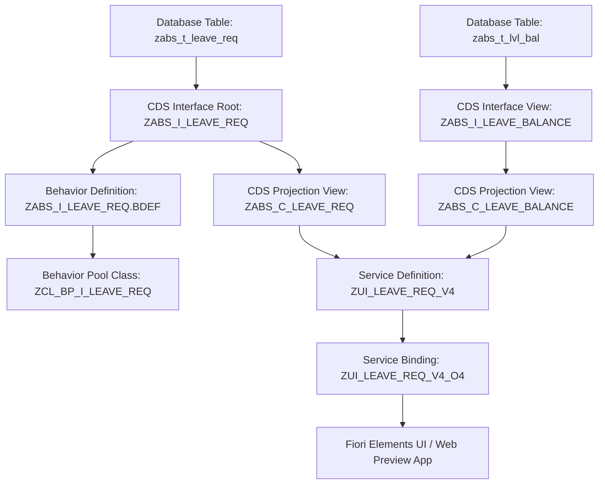

# Employee Leave Management App (SAP BTP ABAP Environment - RAP)

> **Personal Project | SAP BTP ABAP Environment (Steampunk)**  
> An end-to-end RESTful Application Programming Model (RAP) application enabling employees to apply for leave, view leave balances, track approval status, and empower managers to execute Approve/Reject actions. Includes full CDS views, Behavior Definitions (BDEF), ABAP Unit tests, abapGit integration, and an interactive SAP Fiori Horizon UI.

---

## 🌟 Key Highlights & Features

- **End-to-End RAP Business Object**: Managed business object with draft capabilities, instance actions (`submit`, `approve`, `reject`), determinations (`calculateTotalDays`), and validations (`validateDates`, `validateLeaveBalance`).
- **Core Business Rule Validation**: Rejects any leave request where requested working days exceed the employee's available leave quota for that leave category.
- **SAP Fiori Horizon Interface**: Modern List Report and Object Page UI exposing OData V4 services (`ZUI_LEAVE_REQ_V4`).
- **ABAP Unit Test Suite**: Automated test class (`ZCL_TEST_LEAVE_MGMT`) validating EML business logic, edge cases, date constraints, and action side-effects.
- **abapGit Version Control**: Clean package folder structure ready for repository cloning into SAP BTP ADT (ABAP Development Tools in Eclipse).

---

## 🏗️ Architecture & Data Layer



### ABAP RAP Components

| Object Name | Type | Description |
|---|---|---|
| `ZABS_I_LEAVE_REQ` | CDS Interface View | Root entity modeled over table `zabs_t_leave_req` |
| `ZABS_I_LEAVE_BALANCE` | CDS Interface View | Entity representing employee leave balances |
| `ZABS_C_LEAVE_REQ` | CDS Projection View | Consumer view with Fiori `@UI` annotations (LineItem, Facets, DataPoint) |
| `ZABS_I_LEAVE_REQ.BDEF` | Behavior Definition | Defines managed RAP behavior with draft actions, validations, and determinations |
| `ZCL_BP_I_LEAVE_REQ` | ABAP Class | Behavior pool implementation containing local handler class `lhc_LeaveRequest` |
| `ZCL_TEST_LEAVE_MGMT` | ABAP Unit Test Class | Unit tests executing EML operations for positive/negative validation coverage |
| `ZUI_LEAVE_REQ_V4` | Service Definition | Exposes projection entities to OData V4 protocol |

---

## ⚡ Core Business Rules & Validations

1. **Date Constraints (`validateDates`)**:
   - `StartDate` cannot be in the past.
   - `EndDate` must be greater than or equal to `StartDate`.
2. **Quota Validation (`validateLeaveBalance`)**:
   - Queries `zabs_t_lvl_bal` for the employee's current `remaining_days`.
   - If `TotalDays > remaining_days`, appends the entity key to `failed-leaverequest` and returns an error message in `reported-leaverequest`.
3. **Manager Approval (`approve` action)**:
   - Updates status to Approved (`A`).
   - Deducts `total_days` from `remaining_days` and increments `used_days` in database table `zabs_t_lvl_bal`.
4. **Manager Rejection (`reject` action)**:
   - Captures parameter `rejection_reason`.
   - Updates status to Rejected (`R`).

---

## 🧪 ABAP Unit Test Suite (`ZCL_TEST_LEAVE_MGMT`)

The project includes unit tests for EML statements:

```abap
" Example Assertion: Rejection on exceeding balance
METHOD test_exceeding_leave_balance.
  MODIFY ENTITIES OF zabs_i_leave_req
    ENTITY LeaveRequest
      CREATE FIELDS ( EmployeeID LeaveType StartDate EndDate TotalDays Reason )
      WITH VALUE #( (
        %cid       = 'CID_EXCEED_01'
        EmployeeID = 'EMP1002'
        LeaveType  = 'SICK'
        TotalDays  = 10 " Only 4 days available
      ) )
    FAILED DATA(failed)
    REPORTED DATA(reported).

  cl_abap_unit_assert=>assert_not_initial(
    act = failed-leaverequest
    msg = 'Leave request exceeding available balance MUST trigger validation failure'
  ).
ENDMETHOD.
```

---

## 📁 abapGit Repository Structure

Source code is formatted for abapGit import under `abap_repository/`:

```
abap_repository/
├── .abapgit.xml
└── src/
    ├── zabs_i_leave_balance.ddls.asddls
    ├── zabs_i_leave_req.ddls.asddls
    ├── zabs_c_leave_req.ddls.asddls
    ├── zabs_c_leave_balance.ddls.asddls
    ├── zabs_i_leave_req.bdef.asbdef
    ├── zabs_c_leave_req.bdef.asbdef
    ├── zcl_bp_i_leave_req.clas.abap
    ├── zcl_bp_i_leave_req.clas.locals_imp.abap
    ├── zcl_test_leave_mgmt.clas.abap
    ├── zcl_test_leave_mgmt.clas.testclasses.abap
    ├── zui_leave_req_v4.srvd.asddls
    └── zui_leave_req_v4_o4.xml
```

### Importing into SAP BTP ADT
1. Open Eclipse with ABAP Development Tools (ADT).
2. Connect to your SAP BTP ABAP Environment system.
3. Open **abapGit View** (`Window -> Show View -> Other -> abapGit`).
4. Link your git repository or import folder `abap_repository/`.
5. Activate all CDS Views, Behavior Definitions, Classes, and Service Bindings.

---

## 🚀 Running the Interactive Fiori Web App Locally

To test the application locally:

```bash
# 1. Install dependencies
npm install

# 2. Start Vite development server
npm run dev
```

The app will launch at `http://localhost:3000`. You can:
- Apply for leave with real-time RAP validations.
- Test manager Approve / Reject workflows.
- Execute the **ABAP Unit Test Suite** live in browser.
- Inspect CDS views and ABAP code in the built-in **Source Code Inspector**.

---

## 📜 License
MIT License • Created for SAP BTP RAP Portfolio Showcase.
